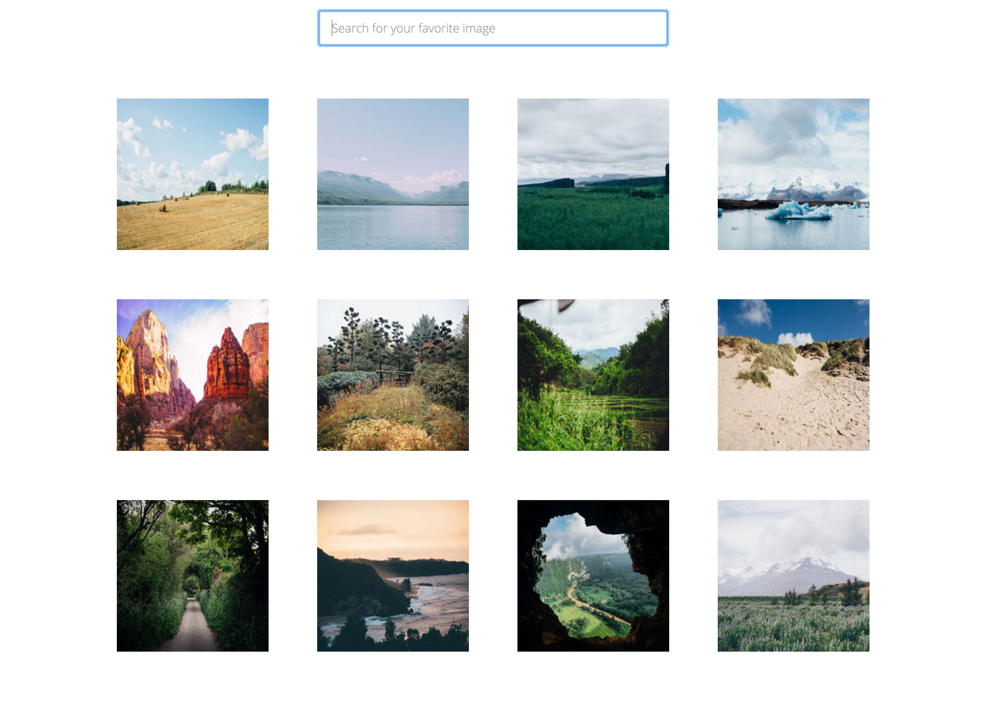

# **Slickbox - A Custom Lightbox**

##### A project built with HTML5, CSS3 and JavaScript. 3.5.2016
#
##### By [Sam Peppard](https://github.com/sampeppard)
#

----
### **Description**

A custom photo gallery with search functionality and a custom-built lightbox.

----
### **Specifications**
| _Behavior_ | _Input_ | _Output_ |
|:---------------------------------------------------------------------:|:---------------------------------------------------------------------------:|:-------------------------------------------------------------------------------------------------------------------:|
| Return select photos when a portion of a photo's caption is entered | "tree" | 2 photos returned |
| Return lightbox application when a particular photo is clicked | click | lightbox initiated |

----

### **Setup/Installation Requirements**

* Clone this repository
* If editing, open project directory in Code Editor of choice
* If viewing, open index.html in a web browser

----

### **Known Bugs**

No known bugs.

----
### **Support and contact details**

For comments or questions, please email sampeppard@gmail.com

----
### **Technologies Used**

* HTML
* CSS
* JavaScript
* jQuery

----
### **Link to project on Github Pages**

https://sampeppard.github.io/slickbox/

----
### **License**

MIT
